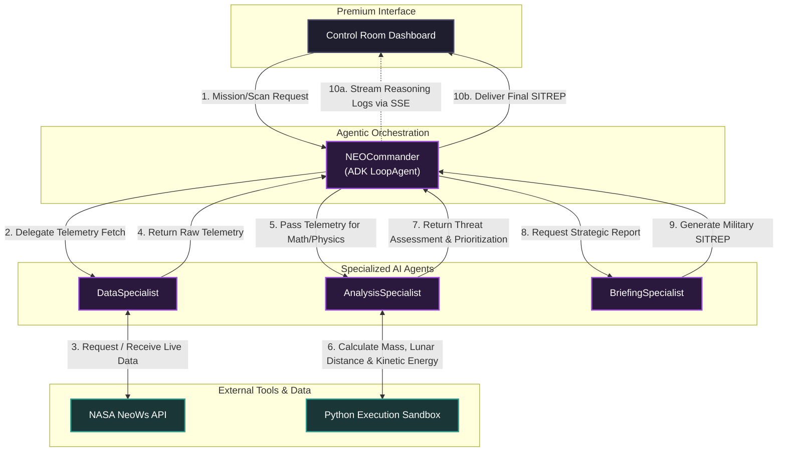

# NEO Threat Calculator 🛰️

> **Planetary Defense via Autonomous Agentic Loops.**

NEO Threat Calculator is an autonomous planetary defense dashboard powered by Google's Agent Development Kit (ADK). It orchestrates a multi-specialist agent loop to fetch live NASA telemetry, execute precise kinetic energy simulations via Python, and deliver strategic SITREPs in a premium "Control Room" interface. Built for speed, precision, and mission-critical reliability.

## 📊 Functional Architecture

## 🚀 Key Features
- **Autonomous Reasoning**: Multi-agent relay powered by Gemini 2.5 Flash.
- **Real-time Streaming**: Sub-30ms reasoning logs via SSE with "Pump-Priming" for infrastructure resilience.
- **Adaptive Tactical Response**: Specialists pivot between general scans and deep hypothetical math (e.g. Unit conversion, Mass simulations).
- **Premium Aesthetics**: Neural link visualization and high-fidelity "Control Room" dashboard.

## 📁 Project Structure
- `/agents` - Logic and adaptive prompts for the NEO Commander and Specialists.
- `/tools` - NASA API integration and Python execution tools.
- `/app` - Web-based "Control Room" frontend.
- `main.py` - FastAPI server with stream-flush optimization.
- `Dockerfile` - Container config for Cloud Run deployment.

## 🎥 Demo Video (Organizers)
- **Duration**: Max 150s
- **Format**: YouTube Unlisted with Voice-Over.
- **Focus**: Observe the "Agentic Recovery" as specialists self-correct during the logic loop.

## 📘 Prototype Documentation
For a deep dive into the engineering process, research, and tactical manuals, see the official mission documentation:
- **[Mission Log (Walkthrough)](docs/MISSION_LOG.md)** - Step-by-step implementation and verification history.
- **[Tactical Order Manual](docs/TACTICAL_ORDERS.md)** - A guide to the available agentic commands.
- **[NotebookLM Source Kit](docs/NOTEBOOKLM_KIT.md)** - The data used to generate AI assets.
- **[Research & Synthesis](docs/RESEARCH_SYNTHESIS.md)** - Initial project planning and ADK digestion.

## 🛠️ Local Development
1. Clone the repo.
2. Install dependencies: `pip install -r requirements.txt`.
3. Set your Google Cloud Project: `gcloud config set project [YOUR_PROJECT_ID]`.
4. Run: `uvicorn main:app --reload`.
5. Interface: `http://localhost:8080/`.

---

*Built for the Google Deepmind Agentic Hackathon 2026.*
