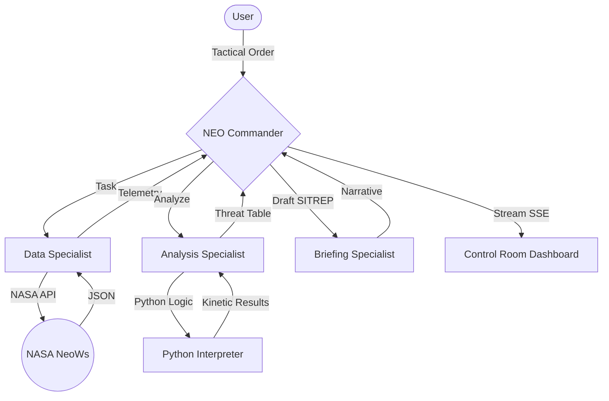

# NEO Threat Calculator - NotebookLM Source Kit (FINAL)

This kit contains the primary architecture and source code for the NEO Threat Calculator agentic project. Use this for generating audio pitches, architecture summaries, and technical walkthroughs.

## 🏗️ Architecture: The "Tactical Loop"
- **Orchestrator**: `NEOCommander` (Google ADK `LoopAgent`).
- **Specialists**:
  - `DataSpecialist`: Fetches live NASA REST data (NeoWs).
  - `AnalysisSpecialist`: **Adaptive Intelligence**. Uses a Python tool to calculate Kinetic Energy (0.5mv²) or handle tactical math like "Lunar Distance" conversion.
  - `BriefingSpecialist`: Translates mathematics into a dramatic military SITREP.
- **Agentic Resilience**: Implements logic flushes and server-side timestamps to overcome infrastructure latency, ensuring the "Operator" (User) always sees current data.

## 📊 Functional Diagram (Mermaid)


## 📄 Core Engine Snippets

### [commander.py](file:///c:/Users/admin/.gemini/antigravity/playground/adk-alpha-1/arc-hackathon/agents/commander.py) (Adaptive Logic)
```python
# Analysis Specialist: Can handle Standard Mission or Specific Tactical Orders
analysis_specialist = Agent(
    name="AnalysisSpecialist",
    model="gemini-2.5-flash",
    instruction="""
    1. MISSION: Default to kinetic energy tables for top 3 threats.
    2. TACTICAL: Prioritize specific user math (Lunar Distances, hypotheticals) using python_interpreter.
    3. PRECISION: Provide exact values from telemetry.
    """
)

# LoopAgent: Orchestrates the specialist relay (Optimized for 30s demo)
commander_agent = LoopAgent(
    name="NEOCommander",
    sub_agents=[data_specialist, analysis_specialist, briefing_specialist],
    max_iterations=3
)
```

### [main.py](file:///c:/Users/admin/.gemini/antigravity/playground/adk-alpha-1/arc-hackathon/main.py) (Streaming & Flush)
```python
@app.get("/stream-assessment")
async def stream_assessment(user_query, session_id):
    # PUMP PRIMING: 4KB invisible block to force Cloud Run stream flushing
    yield f": {' ' * 4096}\n\n"
    
    # Server-Side Timestamps for absolute sync
    def get_ts(): return datetime.datetime.now().strftime("%H:%M:%S")

    async for event in runner.run_async(...):
        # Immediate SSE push with server-side time sync
        yield f"data: {json.dumps({'type': 'log', 'content': msg, 'server_time': get_ts()})}\n\n"

### [nasa_tools.py](file:///c:/Users/admin/.gemini/antigravity/playground/adk-alpha-1/arc-hackathon/tools/nasa_tools.py) (Data Summarization)
```python
def fetch_neo_data_func(api_key: str):
    # Performance Win: Only returns essential fields to minimize LLM context bloat
    summary = []
    for neo in raw_data:
        summary.append({
            "name": neo["name"],
            "velocity_kph": neo["close_approach_data"][0]["relative_velocity"]["kilometers_per_hour"],
            "miss_distance_km": neo["close_approach_data"][0]["miss_distance"]["kilometers"],
            "is_hazardous": neo["is_potentially_hazardous_asteroid"]
        })
    return summary
```
```
